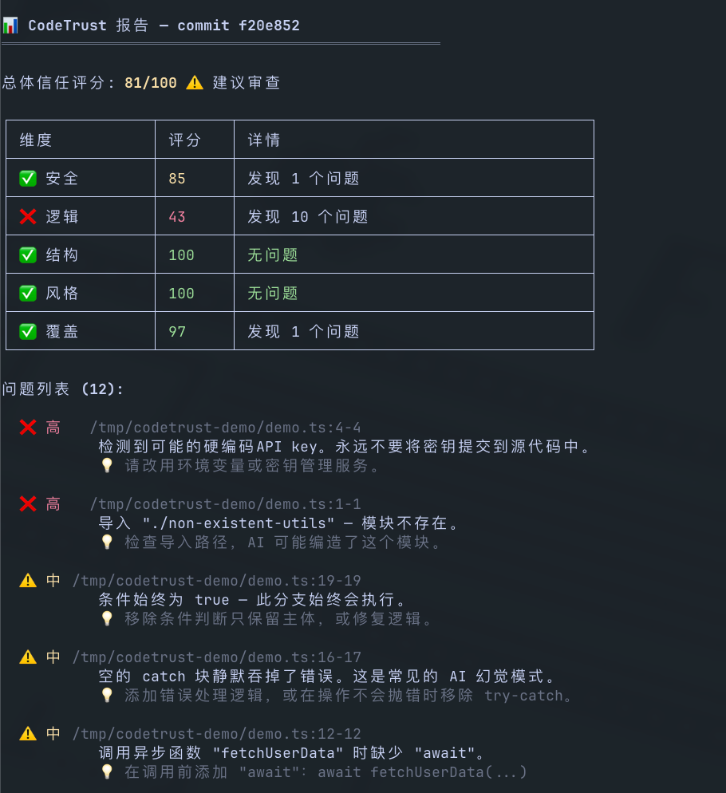

# CodeTrust

> AI 代码信任验证工具 — 用确定性算法审查 AI 生成的代码，不用 LLM 审查 LLM。

[](https://nodejs.org)
[](LICENSE)
[](https://www.npmjs.com/package/@gulu9527/code-trust)

**[English](./README.md) | 中文**



CodeTrust 是一个 **完全本地运行** 的 CLI 工具，专为验证 AI 生成代码（Cursor、Copilot、ChatGPT 等）的质量而设计。它不使用 LLM 来审查 LLM，而是通过 **确定性的静态分析算法** 检测 AI 代码中常见的幻觉模式和质量问题。

## 特性

- **幻觉检测** — 幻影导入、未使用导入、缺失 await、不必要的 try-catch、过度防御性编码、死逻辑分支
- **安全扫描** — 硬编码密钥、eval 使用、SQL 注入、XSS 漏洞检测
- **结构分析** — 圈复杂度、认知复杂度、函数长度、嵌套深度、参数数量
- **风格一致性** — 命名风格混用检测（camelCase / snake_case）
- **覆盖分析** — 检测文件是否有对应的测试文件
- **自动修复** — `codetrust fix` 自动修复安全问题（未使用导入、debugger、宽松等于、未使用变量），支持预演模式
- **五维度评分** — 安全、逻辑、结构、风格、覆盖，加权计算信任总分
- **完全本地** — 代码不上云，零外部请求
- **双语支持** — 中文/英文自动切换

## 安装

```bash
npm install -g @gulu9527/code-trust
```

安装后可以使用 `code-trust` 或 `codetrust` 命令（两个别名均可用）。

## 快速开始

```bash
# 初始化配置文件
codetrust init

# 扫描 git staged 文件
codetrust scan --staged

# 扫描与 main 分支的差异
codetrust scan --diff origin/main

# 扫描指定文件
codetrust scan src/foo.ts src/bar.ts

# JSON 输出（用于 CI/CD）
codetrust scan --staged --format json

# 设置最低分数门槛（低于此分数则退出码为 1）
codetrust scan --staged --min-score 70

# 查看所有规则
codetrust rules list

# 安装 pre-commit hook
codetrust hook install

# 自动修复问题（默认预演模式）
codetrust fix src/

# 应用修复
codetrust fix src/ --apply

# 仅修复指定规则
codetrust fix src/ --apply --rule logic/type-coercion
```

## 信任评分

CodeTrust 从五个维度评估代码，加权计算总分（0-100）：

| 维度 | 权重 | 说明 |
|------|------|------|
| 安全 | 30% | 硬编码密钥、eval、SQL 注入、XSS |
| 逻辑 | 25% | 幻觉检测：死逻辑、未使用变量、重复条件 |
| 结构 | 20% | 复杂度、函数长度、嵌套深度 |
| 覆盖 | 15% | 测试文件覆盖 |
| 风格 | 10% | 命名一致性 |

### 等级

| 分数 | 等级 | 含义 |
|------|------|------|
| >= 90 | ✅ 高信任 | 可安全合并 |
| >= 70 | ⚠️ 建议审查 | 建议审查后合并 |
| >= 50 | ⚠️ 低信任 | 需仔细审查 |
| < 50 | ❌ 不可信 | 不应合并 |

## 内置规则（29 条）

### 幻觉检测（逻辑维度）
| 规则 ID | 严重度 | 说明 |
|---------|--------|------|
| `logic/phantom-import` | high | 导入不存在的相对路径模块（AI 幻觉） |
| `logic/missing-await` | medium | async 函数调用缺少 await |
| `logic/any-type-abuse` | medium | 滥用 `any` 类型绕过类型检查 |
| `logic/type-coercion` | medium | 宽松等于（`==`）导致隐式类型转换 |
| `logic/no-nested-ternary` | medium | 嵌套三元表达式降低可读性 |
| `logic/unnecessary-try-catch` | medium | AI 常生成包裹简单语句的 try-catch |
| `logic/dead-branch` | medium | 始终 true/false 的条件、不可达代码 |
| `logic/duplicate-condition` | medium | if-else 链中重复的条件 |
| `logic/empty-catch` | medium | 空 catch 块或仅原样 re-throw |
| `logic/identical-branches` | medium | if/else 两个分支代码完全一样 |
| `logic/no-non-null-assertion` | medium | 非空断言 (!) 可能导致运行时崩溃 |
| `logic/no-self-compare` | medium | 自比较 (x === x) 始终为 true/false |
| `logic/no-return-assign` | medium | return 语句中使用赋值 (=)，可能误用了 === |
| `logic/promise-void` | medium | 浮动 Promise — async 调用未 await 或 return |
| `logic/unused-import` | low | 导入了但从未使用的模块 |
| `logic/over-defensive` | low | 过度的 null/undefined 守卫 |
| `logic/unused-variables` | low | 声明但未使用的变量 |
| `logic/redundant-else` | low | return/throw 后不必要的 else |
| `logic/magic-number` | low | 未解释的魔术数字，应提取为命名常量 |
| `logic/duplicate-string` | low | 相同字符串字面量重复出现 3 次以上 |
| `logic/no-reassign-param` | low | 重新赋值函数参数 |
| `logic/no-async-without-await` | low | async 函数内部未使用 await |
| `logic/no-useless-constructor` | low | 空构造函数或仅调用 super() 的构造函数 |
| `logic/console-in-code` | info | 遗留的 console.log 调试语句 |

### 安全规则
| 规则 ID | 严重度 | 说明 |
|---------|--------|------|
| `security/hardcoded-secret` | high | 硬编码的 API 密钥、密码、token |
| `security/eval-usage` | high | eval()、new Function() 等危险调用 |
| `security/sql-injection` | high | SQL 查询中的字符串拼接 |
| `security/no-debugger` | high | 遗留的 debugger 语句 |
| `security/dangerous-html` | medium | innerHTML / dangerouslySetInnerHTML |

## 自动修复

`codetrust fix` 可以自动修复特定的安全问题。默认以 **预演模式** 运行 — 不会修改任何文件，直到你传入 `--apply`。

### 可修复规则

| 规则 ID | 修复动作 |
|---------|----------|
| `security/no-debugger` | 删除 `debugger` 所在行 |
| `logic/unused-import` | 删除未使用的导入行 |
| `logic/type-coercion` | 将 `==` 替换为 `===`，`!=` 替换为 `!==` |
| `logic/unused-variables` | 删除未使用的变量声明 |

```bash
# 预览修复（预演模式，不修改文件）
codetrust fix src/

# 应用修复
codetrust fix src/ --apply

# 仅修复指定规则
codetrust fix src/ --apply --rule logic/type-coercion
```

## 配置

运行 `codetrust init` 生成 `.codetrust.yml`：

```yaml
version: 1

include:
  - "src/**/*.ts"
  - "src/**/*.js"
exclude:
  - "**/*.test.ts"
  - "**/node_modules/**"

weights:
  security: 0.30
  logic: 0.25
  structure: 0.20
  style: 0.10
  coverage: 0.15

thresholds:
  min-score: 70
  max-function-length: 40
  max-cyclomatic-complexity: 10
  max-cognitive-complexity: 20
  max-nesting-depth: 4
  max-params: 5

rules:
  disabled: []
  overrides: {}
```

## CI/CD 集成

### GitHub Action（可复用）

```yaml
name: CodeTrust
on:
  pull_request:
    branches: [main]

jobs:
  trust-scan:
    runs-on: ubuntu-latest
    steps:
      - uses: actions/checkout@v4
        with:
          fetch-depth: 0
      - uses: GuLu9527/CodeTrust@main
        with:
          min-score: 70
```

或手动安装：

```yaml
      - uses: actions/setup-node@v4
        with:
          node-version: '20'
      - run: npm install -g @gulu9527/code-trust
      - run: codetrust scan --diff origin/main --min-score 70
```

### Git Pre-commit Hook

```bash
codetrust hook install
```

安装后每次 `git commit` 会自动运行 CodeTrust 扫描。使用 `git commit --no-verify` 跳过。

## 语言切换

CodeTrust 自动检测系统语言。手动切换：

```bash
# 强制中文
CODETRUST_LANG=zh codetrust scan --staged

# 强制英文
CODETRUST_LANG=en codetrust scan --staged
```

## 技术栈

- **语言**: TypeScript 5.x
- **运行时**: Node.js 20+
- **AST 解析**: @typescript-eslint/typescript-estree
- **CLI**: Commander.js
- **Git**: simple-git
- **终端 UI**: picocolors + cli-table3
- **配置**: cosmiconfig
- **测试**: Vitest
- **构建**: tsup

## License

[Apache-2.0](LICENSE)
